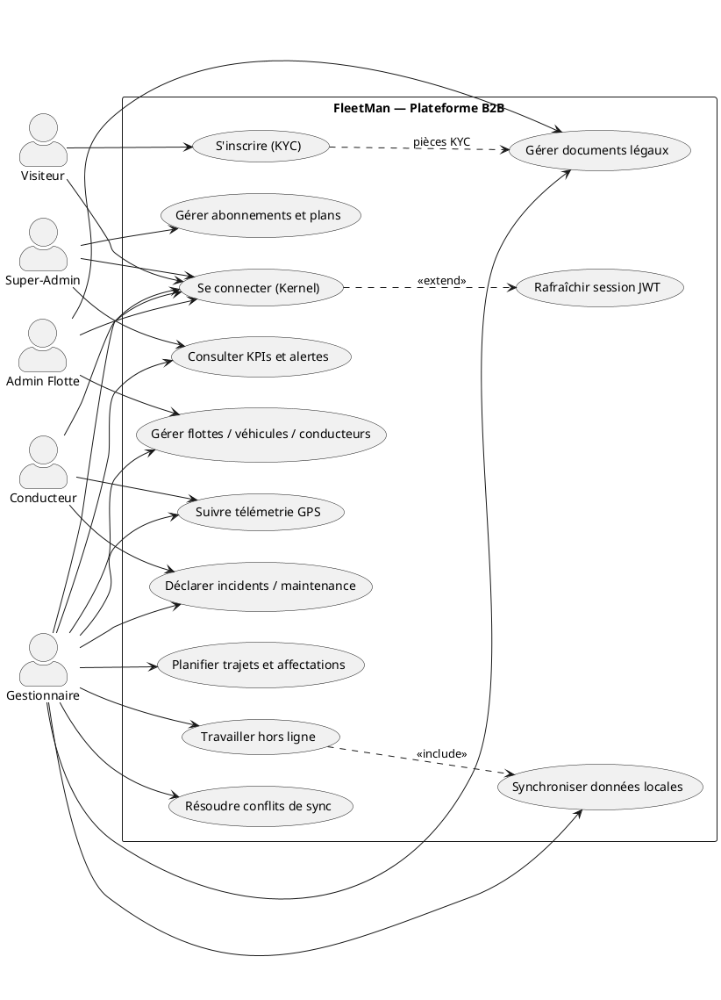
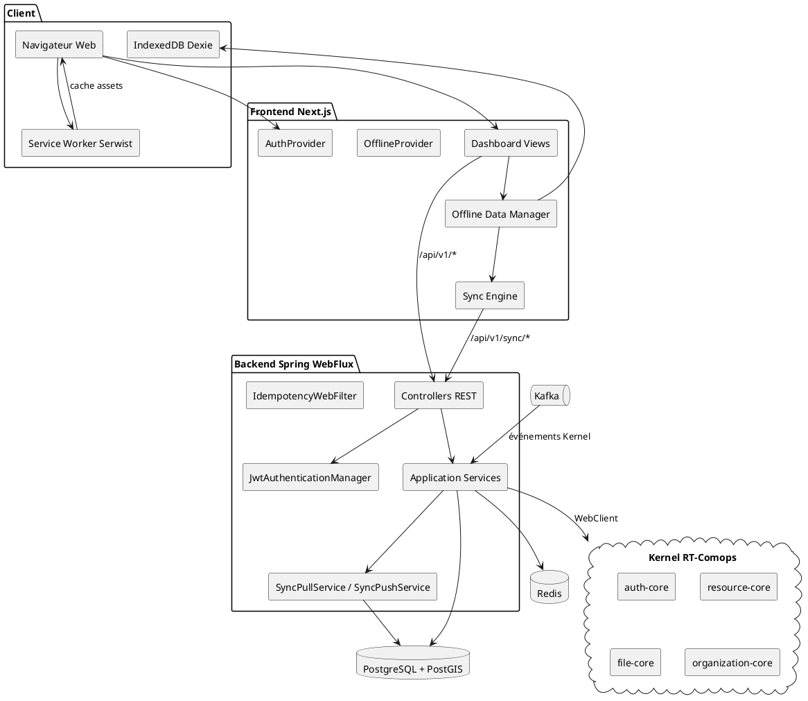
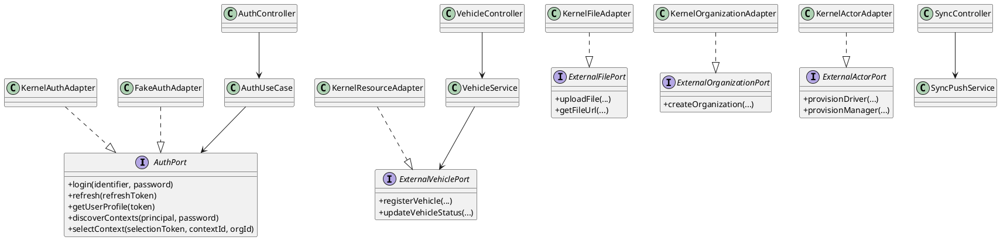
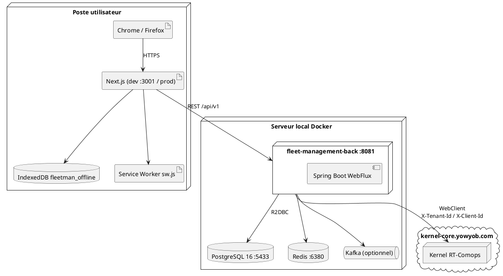
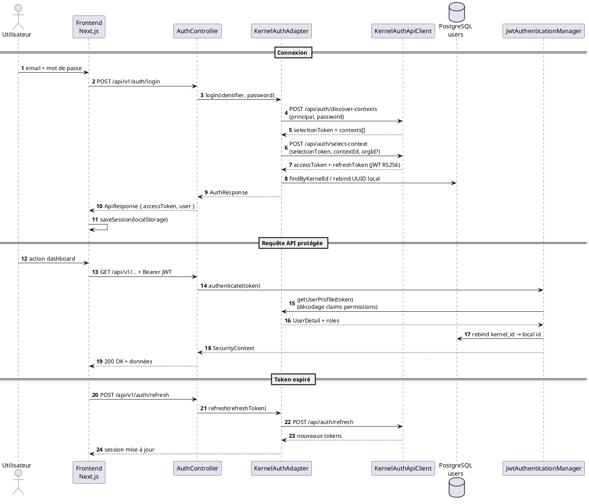
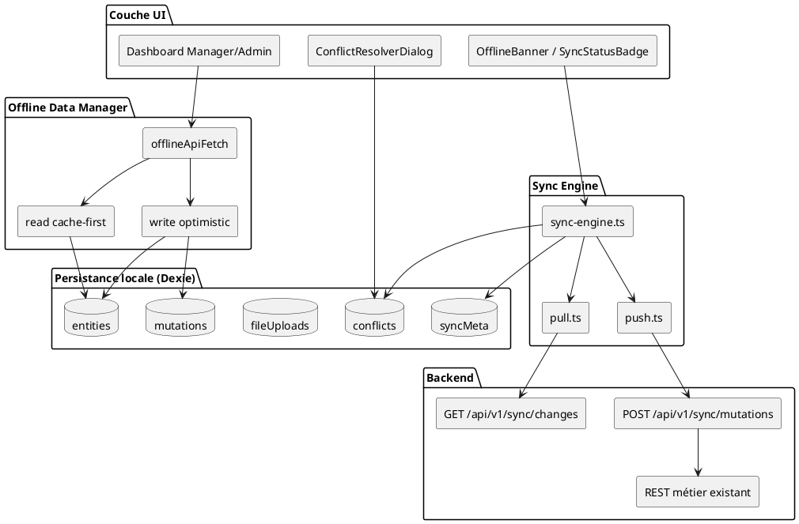
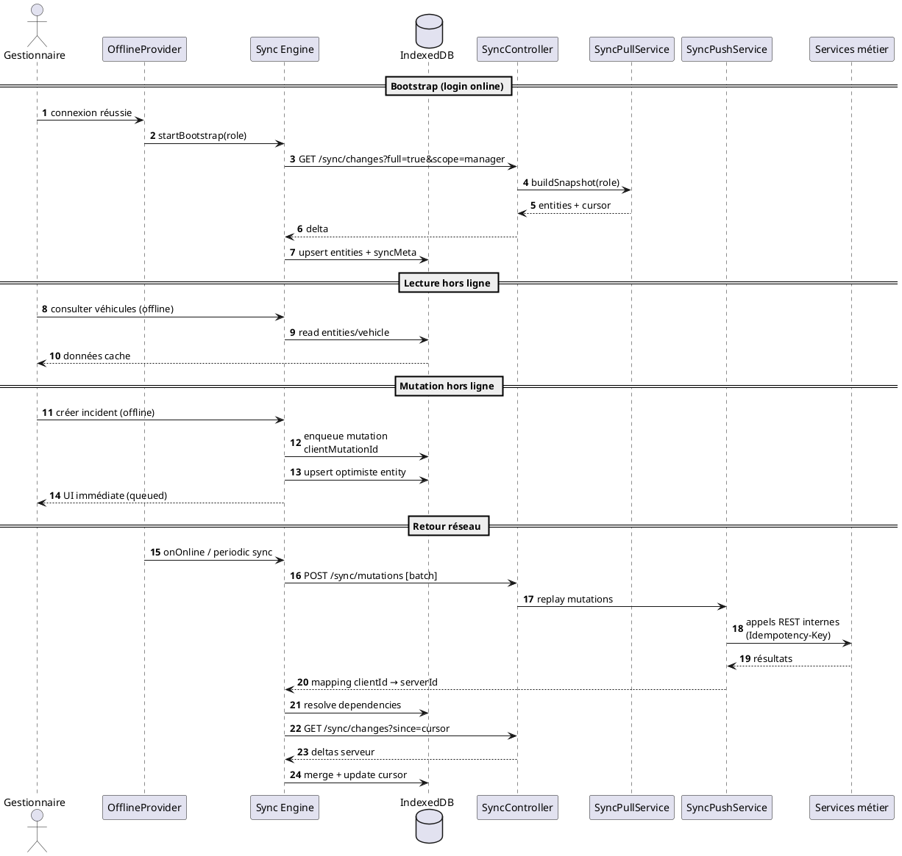
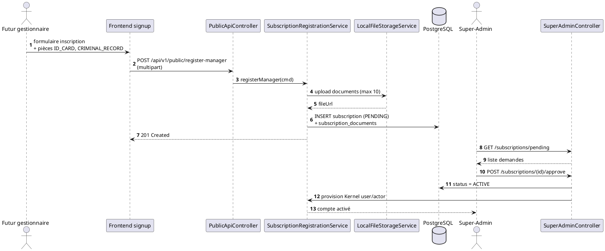
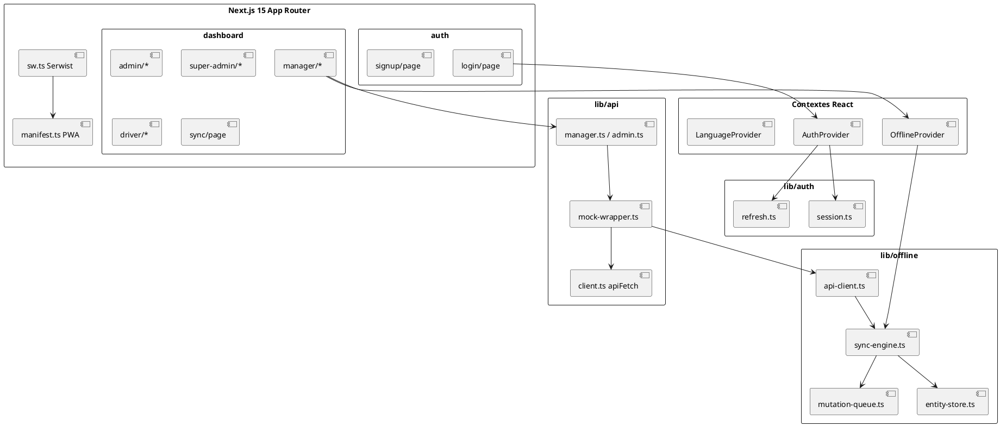
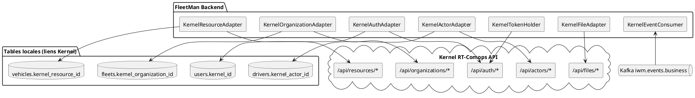

# Diagrammes PlantUML — FleetMan (à compiler)

Compilez chaque bloc avec [PlantUML](https://plantuml.com) et placez les PDF/PNG générés dans le dossier `figures/` avec le **nom de fichier indiqué**.

## Légende

| Statut | Signification |
|--------|---------------|
| **OBSOLÈTE** | Présent dans le rapport mais ne reflète plus l'implémentation actuelle — à régénérer |
| **MANQUANT** | Nouveau diagramme à ajouter au rapport |

## Diagrammes encore valides (pas de régénération obligatoire)

Les diagrammes suivants restent cohérents avec le code métier actuel (ajustements cosmétiques optionnels) :

- `DiagrammeClasses_Domaine`
- `DiagrammeEtats_Trip`
- `DiagrammeSequence_GPS`
- `DiagrammeEtats_Incident`
- `DiagrammeSequence_Incident`
- `DiagrammeEtats_Schedule`
- `DiagrammeSequence_Conflits`
- `DiagrammeSequence_JobDocuments`
- `DiagrammeActivite_KPI`

---

## 1. DiagrammeCasUtilisation — **OBSOLÈTE**

**Fichier de sortie :** `figures/DiagrammeCasUtilisation.pdf`

Ajouts requis : mode offline, synchronisation, inscription KYC gestionnaire, intégration Kernel.



---

## 2. DiagrammePackages — **OBSOLÈTE**

**Fichier de sortie :** `figures/DiagrammePackages.pdf`

```plantuml
@startuml DiagrammePackages
skinparam packageStyle rectangle
skinparam linetype ortho

package "fleet_management_front (Next.js 15)" {
  package "app" { package "dashboard" package "auth" package "offline" }
  package "components" { package "dashboard/views" package "offline" }
  package "lib" {
    package "api"
    package "auth"
    package "offline" {
      [sync-engine]
      [mutation-queue]
      [repositories]
      [api-client]
    }
  }
}

package "fleet-management-back" {
  package "domain" {
    package "model"
    package "ports.in"
    package "ports.out"
    package "exception"
  }
  package "application" { package "service" }
  package "infrastructure" {
    package "adapters.inbound.rest"
    package "adapters.outbound.persistence"
    package "adapters.outbound.external" {
      [KernelAuthAdapter]
      [KernelResourceAdapter]
      [KernelFileAdapter]
      [FakeAuthAdapter]
    }
    package "config"
  }
}

package "Kernel RT-Comops" {
  [auth-core]
  [organization-core]
  [resource-core]
  [file-core]
}

fleet_management_front --> fleet-management-back : HTTPS REST
fleet-management-back --> Kernel RT-Comops : WebClient
@enduml
```

---

## 3. DiagrammeComposants — **OBSOLÈTE**

**Fichier de sortie :** `figures/DiagrammeComposants.pdf`



---

## 4. DiagrammeClasses_Ports — **OBSOLÈTE**

**Fichier de sortie :** `figures/DiagrammeClasses_Ports.pdf`



---

## 5. DiagrammeDeploiement — **OBSOLÈTE**

**Fichier de sortie :** `figures/DiagrammeDeploiement.pdf`



---

## 6. DiagrammeSequence_Auth — **OBSOLÈTE**

**Fichier de sortie :** `figures/DiagrammeSequence_Auth.pdf`

Remplace l'ancien flux auth locale par le flux Kernel en 2 étapes.



---

## 7. DiagrammeArchitecture_Offline — **MANQUANT**

**Fichier de sortie :** `figures/DiagrammeArchitecture_Offline.pdf`



---

## 8. DiagrammeSequence_Sync — **MANQUANT**

**Fichier de sortie :** `figures/DiagrammeSequence_Sync.pdf`



---

## 9. DiagrammeSequence_InscriptionKYC — **MANQUANT**

**Fichier de sortie :** `figures/DiagrammeSequence_InscriptionKYC.pdf`



---

## 10. DiagrammeComposants_Frontend — **MANQUANT**

**Fichier de sortie :** `figures/DiagrammeComposants_Frontend.pdf`



---

## 11. DiagrammeIntegration_Kernel — **MANQUANT**

**Fichier de sortie :** `figures/DiagrammeIntegration_Kernel.pdf`

Vue d'ensemble de l'intégration réalisée (remplace le « plan en 6 phases » comme vision cible).



---

## Instructions de compilation

```bash
# Exemple avec PlantUML CLI
cd figures/
plantuml -tpdf ../diagrammes/*.puml

# Ou en ligne : copier chaque bloc @startuml … @enduml
# sur https://www.plantuml.com/plantuml
```

Une fois les images générées, placez-les dans `figures/` et signalez-moi pour intégration finale dans le rapport LaTeX.
